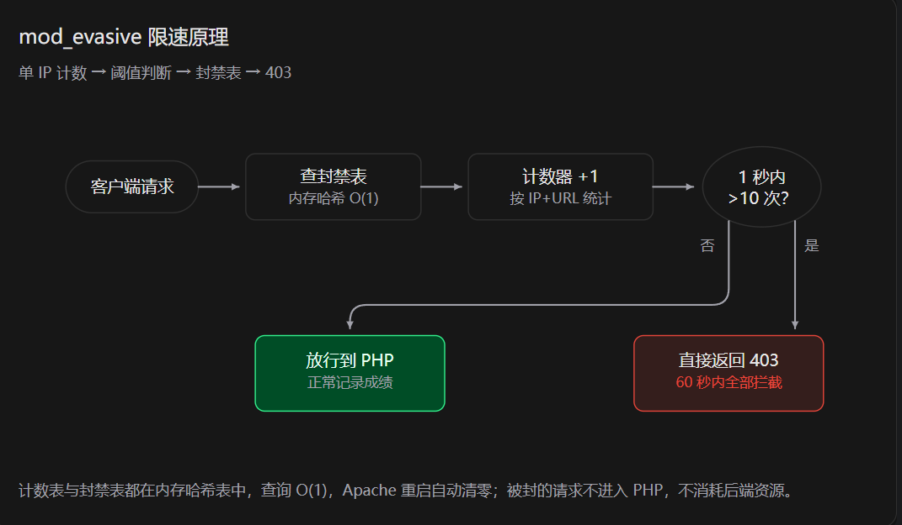

# 打字比赛 · 二次开发说明

## 项目来源与声明

本项目基于开源项目 **[typing-challenge（字速挑战）](https://github.com/yan-stone-computer/typing-challenge)** 二次开发而来，原作者为[yan-stone-computer (3NF_CovaBond)](https://github.com/yan-stone-computer)。感谢原作者的开源分享。

- 原版是一个纯前端单页应用：中英文长文本打字挑战，实时统计速度、准确率、完成度，按公式生成 0-100 综合分，成绩保存在浏览器 `localStorage`（仅本机可见）。
- 本仓库在保留原版核心玩法、界面与评分算法的基础上，围绕 **"线下多人比赛"** 场景做了系统性改造：成绩云端汇总、成绩本机双备份、现场全屏管控、接口防护，并新增了配套的 PHP 后端与测试工具。
- 目录中的 `index(原始).html` 为上游原版快照，可与本仓库的 `index.html` 直接对比查看全部改动。

## 为什么需要改造

| 场景   | 原版               | 比赛需要               |
| ---- | ---------------- | ------------------ |
| 成绩存储 | localStorage，仅本机 | 多台电脑同场竞技，成绩要汇总到一处  |
| 成绩凭证 | 无                | 云端 + 本机文件双备份，防丢失   |
| 现场秩序 | 普通网页             | 全屏锁定、防切屏、防开发者工具    |
| 网络环境 | 无网络请求            | 支持百人级并发提交，可抵抗恶意刷接口 |

## 主要修改内容

### 一、品牌与文案（index.html）

- 名称「字速挑战」→「打字比赛」，页脚署名统一为「广西师范大学 · 技术部」。
- 页脚副标题由「本地个人记录」改为「云端成绩记录」。

### 二、成绩云端化（新增 api.php）

新增 PHP 后端接口（与 index.html 同目录部署），无数据库依赖：

- **存储**：`data/scores.jsonl`，每条成绩一行 JSON，追加写（`FILE_APPEND + LOCK_EX`），高并发下锁持有时间极短；查询使用共享锁，读写互不阻塞。
- **接口**：
  - `POST api.php?action=login`（JSON：password, id）—— 校验现场访问密码，签发绑定学号的 HMAC 成绩签名令牌（默认 8 小时有效）；
  - `GET  api.php?action=summary&id=学号&lang=语言` —— 个人最佳 + 最近 5 条；
  - `POST api.php?action=submit`（JSON 成绩 + 令牌）—— 验签通过才保存，返回最新汇总；
  - `GET  api.php?action=list&key=管理密钥&format=csv` —— 导出全部成绩（带 BOM，Excel 直接打开）。
- **鉴权与防伪**：访问密码只存在服务端 `APP_KEY`（现场公布，不写进网页源码）；提交必须携带登录时签发的令牌 `HMAC-SHA256(学号|过期时间, APP_SECRET)`，服务器恒定时间比较验签，知道接口地址但拿不到令牌就无法伪造成绩。
- **幂等去重**：每条提交携带唯一 uid，服务器检查最近 20 条，网络重试不会产生重复记录。
- **安全防护**：URL ≤ 2KB、请求体 ≤ 4KB（超限 413/414）、请求方法白名单（405）、字段截断与非法 UTF-8 清洗、数值限幅；兼容 PHP 5.4 ~ 8.x。
- 首次请求自动将旧版 `scores.json` 迁移为 `scores.jsonl`。

### 三、前端成绩逻辑（index.html）

- **进场同步**：解锁挑战时按「学号 + 语言」从服务器拉取个人最佳与最近成绩（换电脑也能看到），服务器不可用时自动回退 localStorage。
- **交卷上传**：挑战结束自动上传成绩；失败后**每 5 秒无限重试**，状态栏实时显示重试次数；服务器按 uid 去重，重复上传无副作用。
- **本机备份**：同一份数据自动下载为 `打字成绩_学号_时间.json` 到本机下载文件夹，与云端构成**双备份**（替代原版的「截取全屏 / 保存到桌面」）。
- **自动切人**：成绩页按钮变为 10 秒倒计时「完成，下一位（N 秒后自动）」，超时自动回到登记页；若成绩仍在重试上传则显示「等待成绩上传…」暂不切人，上传尘埃落定后再切。手动点击随时可切。

### 四、现场全屏管控（index.html）

- **登记页首次交互即全屏**（浏览器要求全屏必须由用户手势触发），进入挑战后保持全屏。
- 全屏被退出后 400ms 自动重回；被浏览器冷却期挡住时显示「点击任意位置恢复」遮罩。
- 拦截 `Esc`、鼠标右键、`F12`、`Ctrl+Shift+I/J/C/K`、`Ctrl+U`。
- **组织者逃生口**：`Alt + X` 永久退出全屏模式。

### 五、部署与运维配套（新增文件）

| 文件                   | 用途                                                |
| -------------------- | ------------------------------------------------- |
| `api.php`            | 成绩接口（见上）                                          |
| `stress_test.py`     | 压测脚本：模拟 N 人 × 多轮并发，keep-alive 连接复用，校验记录增量与 uid 去重 |
| `rate_limit_test.py` | 限速验证脚本：多线程高频请求，验证 Web 层封禁是否生效                     |
| `README.md`          | 本文档                                               |

**服务端配套措施**（不在本仓库内）：

- Apache + PHP（`mod_php`，php-fpm worker 数按服务器内存调优）；
- `mod_evasive` 单 IP 限速：1 秒内同一 URL 超 10 次即封禁 60 秒（实测第 17 个请求触发）；
- 服务端本机实测约 **161 请求/秒**，而百人比赛的真实负载约 1~2 请求/秒，余量充足。

**mod_evasive 限速原理**：



```
客户端请求 → 查封禁表（内存哈希 O(1)）→ 计数器 +1（按 IP+URL 统计）→ 1 秒内 > 10 次？
 ├─ 否 → 放行到 PHP，正常记录成绩
 └─ 是 → 直接返回 403，60 秒内全部拦截
```

计数表与封禁表都在内存哈希表中，查询 O(1)，Apache 重启自动清零；被封的请求不进入 PHP，不消耗后端资源。

## 线上部署

- 环境：CentOS 7 + Apache + PHP（5.4 兼容写法，升级至 7.4+ 无需改动）。
- 部署文件：`index.html` + `api.php`（静态资源沿用原版）。
- 数据目录 `data/` 自动生成，附 `.htaccess` 禁止直连下载（nginx 需额外配置 `deny all`）。
- 导出成绩：`api.php?action=list&key=管理密钥&format=csv`；清空重开一场：删除 `data/scores.jsonl`。
- ⚠️ 上线前必须修改 `api.php` 顶部的三个密钥：`ADMIN_KEY`（导出成绩）、`APP_KEY`（现场访问密码）、`APP_SECRET`（成绩签名），全部换成随机字符串；访问密码活动现场公布，不写进任何网页源码。

## 比赛机推荐配置

用 Chrome kiosk 模式做桌面快捷方式，启动即全屏、无地址栏：

```
"C:\Program Files\Google\Chrome\Application\chrome.exe" --kiosk --new-window http://比赛机访问地址/
```

## 已知边界

- 访问密码与成绩签名均由服务端校验：登记页提交密码到 `action=login`，验证通过领取绑定学号的 HMAC 令牌（默认 8 小时有效），`action=submit` 验签通过才入库；网页源码不含密码，未到场拿到现场密码的人无法伪造成绩。**残余风险**：知道密码的人仍可为**自己的学号**提交伪造高分（令牌不与真人绑定），现场以监考与本机成绩文件交叉核对兜底；离线场景下成绩仅存本机，不影响云端数据
- `action=summary` 按「学号 + 语言」查询个人成绩，未做鉴权——知道学号可查看他人成绩，属低敏感信息，现场可接受。
- 全屏无法 100% 阻止退出（浏览器保留键属安全底线），但自动重回机制可保证选手实际无法保持退出状态。
- 成绩数据以服务器为准；本机 JSON 文件为人工核对用的第二凭证。

## 文件对照

| 文件                                      | 状态   | 说明                                        |
| --------------------------------------- | ---- | ----------------------------------------- |
| `index.html`                            | 修改   | 由原版 `index(原始).html` 改造（161 处新增 / 82 处修改） |
| `index(原始).html`                        | 原版快照 | 来自上游仓库，用于对比                               |
| `api.php`                               | 新增   | 成绩接口                                      |
| `mod_evasive.png`                       | 新增   | 限速原理示意图（本文档引用）                            |
| `stress_test.py` / `rate_limit_test.py` | 新增   | 测试工具                                      |
| `recruitment-cover.jpg`、站点图标等           | 未改动  | 沿用原版资源                                    |
